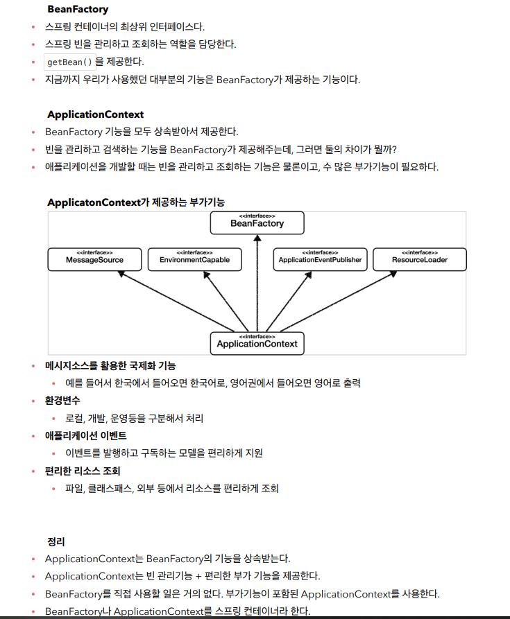

# 스프링 

객체지향 설계에서 사용자는 인터페이스에 의존해야하고 코드의 수정없이 부품을 수정해야하는데 다형성만으로는 OCP  , DIP를 지킬 수 없다.
- 모든 설계에 역할( 인터페이스 )과 구현( 구현체 )를 분리하자

* OCP (개방-폐쇄 원칙) :  확장에는 열려있고 변경엔 닫혀있어야 한다
* DIP ( 의존관계 역전 원칙 ) : 추상화에 의존해야지 구체화에 의존하면 안된다 ( 구현 클래스에 의존하지말고 인터페이스에 의존해야한다 )

## 스프링 객체지향

스프링은 DI(의존성 주입)으로 위의 문제를 해결 할 수 있다

- 스프링 컨테이너는 빈객체를 싱글톤으로 관리한다
 
- 빈으로 등록한 객체는 사용할때마다 생성해서 사용하는것이 아니고 , 빈 객체가 생성될 떄 CGLIB이라는 가상의 복제 객체를 만들어서 호출 할 때마다 재사용한다
 
- @Bean만 사용해도 스프링빈으로 등록하지만 , @Configuration을 안붙이면 싱글톤으로 관리하지않는다. ( 스프링 컨테이너가 관리하지 않음 )